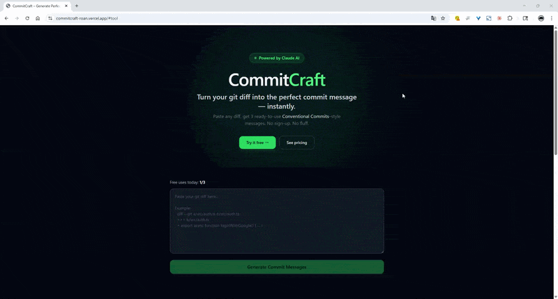

# CommitCraft

**Turn your git diff into the perfect commit message — instantly.**

Paste any git diff, get 3 ready-to-use [Conventional Commits](https://www.conventionalcommits.org/)–style messages in seconds. Powered by Claude AI.

🔗 **[commitcraft-roan.vercel.app](https://commitcraft-roan.vercel.app)**

---



---

## Why CommitCraft

Writing good commit messages is easy to skip and hard to do consistently — especially after a long coding session. Switching to Conventional Commits makes it worse: you stare at the diff wondering whether it's a `feat` or a `fix`.

CommitCraft reads your actual diff and generates 3 distinct, opinionated messages. You pick the one that fits.

---

## Features

- **3 variants per generation** — broad, specific, and somewhere in between. You decide.
- **Conventional Commits format** — `feat`, `fix`, `chore`, `refactor`, `docs`, and more
- **No sign-up required** — free tier works immediately
- **1-click copy** — paste straight into your terminal
- **Powered by Claude AI** — understands context, not just pattern matching

---

## How It Works

```bash
# 1. Get your diff
git diff --staged

# 2. Paste it into CommitCraft

# 3. Get 3 commit messages. Pick one. Done.
git commit -m "feat(auth): add JWT refresh token rotation"
```

---

## Pricing

| Plan | Price | Generations |
|------|-------|-------------|
| Free | $0 / forever | 3 per day, no sign-up |
| Pro  | $9 / month | Unlimited + priority support |

[→ Try it free](https://commitcraft-roan.vercel.app)

---

## Tech Stack

- **Framework**: Next.js (TypeScript)
- **AI**: Claude API (Anthropic)
- **Deployment**: Vercel
- **Payments**: Lemon Squeezy

---

## Local Development

```bash
git clone https://github.com/Hirogure/commitcraft.git
cd commitcraft
npm install
cp .env.local.example .env.local
# Add your API keys to .env.local
npm run dev
```

See `.env.local.example` for required environment variables.

---

## Contributing

Issues and PRs are welcome. If you've found a case where the generated messages are off, please share the diff — that's the most useful feedback.

---

## License

MIT
